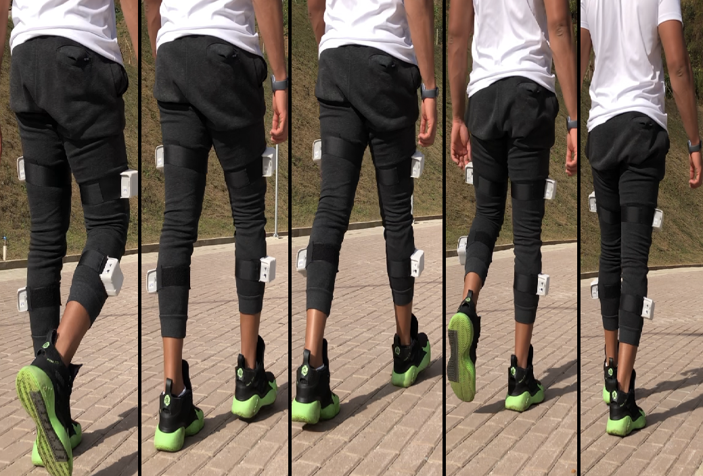

# Human-Activity-Recognition-HAR-LSTM
This repository have a deep learning model to walking activity recognition with data collected by wearable sensors. In the figure below we can see the sensors positioned on the user's leg in the collection of data referring to walking activity.

